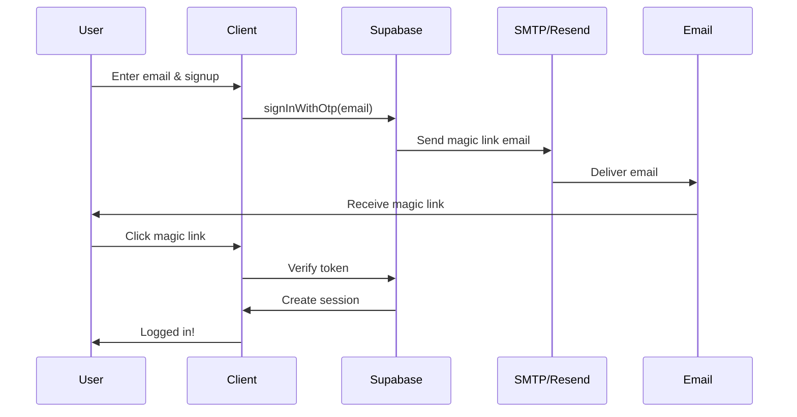

# Supabase Email Configuration Guide

## Overview

Your application uses Supabase Auth for email verification via magic links (OTP). For emails to send successfully, you need to configure Supabase's email settings.

## Current Issue

The "error sending magic link email" occurs because Supabase doesn't have SMTP configured yet. By default, Supabase uses their built-in email service which has limitations.

## Solution Options

### Option 1: Use Resend SMTP with Supabase (Recommended)

Since you already have a Resend API key, you can configure Supabase to send emails through Resend's SMTP.

#### Steps:

1. **Get Resend SMTP Credentials**
   - Go to [Resend Dashboard](https://resend.com/overview)
   - Navigate to **API Keys** or **SMTP** section
   - Get your SMTP credentials:
     - Host: `smtp.resend.com`
     - Port: `465` (SSL) or `587` (TLS)
     - Username: `resend`
     - Password: Your Resend API key (starts with `re_`)

2. **Configure Supabase SMTP**
   - Go to your [Supabase Dashboard](https://app.supabase.com)
   - Select your project
   - Navigate to **Settings** → **Auth** → **SMTP Settings**
   - Enable custom SMTP
   - Enter the Resend SMTP details:
     ```
     Host: smtp.resend.com
     Port: 465
     Username: resend
     Password: <your-resend-api-key>
     Sender email: noreply@yourdomain.com (or onboarding@resend.dev for testing)
     ```
   - Click **Save**

3. **Configure Email Templates (Optional)**
   - In Supabase Dashboard: **Auth** → **Email Templates**
   - Customize the "Magic Link" template to match your brand
   - Variables available: `{{ .ConfirmationURL }}`, `{{ .SiteURL }}`, `{{ .Token }}`

4. **Verify Domain in Resend (For Production)**
   - Go to Resend Dashboard → **Domains**
   - Add your domain (e.g., `yourdomain.com`)
   - Add DNS records as instructed
   - Update sender email in Supabase to use your verified domain

### Option 2: Use Supabase's Built-in Email Service

Supabase offers a built-in email service with limitations:
- **Dev/Hobby tier**: 3 emails per hour
- **Pro tier**: Higher limits

#### Steps:

1. Go to Supabase Dashboard → **Settings** → **Auth**
2. Ensure "Enable Email Confirmations" is ON
3. Customize email templates if desired
4. No SMTP configuration needed

**Note**: The rate limits are quite restrictive, so this is only suitable for development/testing.

### Option 3: Use Other SMTP Providers

You can also use Gmail, SendGrid, Mailgun, or any other SMTP provider. Follow similar steps to Option 1 with your provider's SMTP credentials.

## Testing the Configuration

After configuring SMTP:

1. **Start your application**:
   ```bash
   pnpm dev
   ```

2. **Test signup flow**:
   - Navigate to the signup page
   - Enter a valid email address
   - Click "Create Account"
   - Check your email inbox (and spam folder)

3. **Verify in Supabase Dashboard**:
   - Go to **Auth** → **Users**
   - Check if the user was created
   - Monitor **Logs** for any email sending errors

## Environment Variables

Your `.env` file should have:

```bash
# Supabase Configuration
VITE_SUPABASE_URL=https://your-project.supabase.co
VITE_SUPABASE_ANON_KEY=your_supabase_anon_key

# Resend (used for other emails like contact forms)
RESEND_API_KEY=re_xxxxxxxxxxxxx
RESEND_FROM_EMAIL=noreply@yourdomain.com

# Frontend URL for redirects
FRONTEND_URL=http://localhost:8080
```

## Troubleshooting

### "Email rate limit exceeded"
- You're sending too many emails too quickly
- Wait 60 seconds between requests
- Consider upgrading Supabase tier or using custom SMTP

### "SMTP configuration invalid"
- Double-check SMTP credentials
- Ensure port is correct (465 for SSL, 587 for TLS)
- Verify Resend API key is current

### Email not arriving
- Check spam/junk folder
- Verify sender email is correct
- Check Supabase logs for delivery errors
- Ensure domain is verified in Resend (for production)

### "Email service not configured"
- Follow Option 1 or Option 2 above
- SMTP settings must be saved in Supabase Dashboard

## Email Flow Architecture



## Next Steps

1. ✅ Choose an option above (Option 1 recommended)
2. ✅ Configure SMTP in Supabase Dashboard
3. ✅ Test the signup flow
4. ✅ Verify emails are being delivered
5. ✅ (Production) Verify your domain in Resend

## Need Help?

- [Supabase SMTP Documentation](https://supabase.com/docs/guides/auth/auth-smtp)
- [Resend SMTP Documentation](https://resend.com/docs/send-with-smtp)
- Check the browser console for detailed error messages
- Check Supabase Dashboard → Logs for server-side errors
